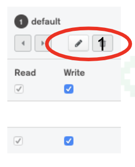
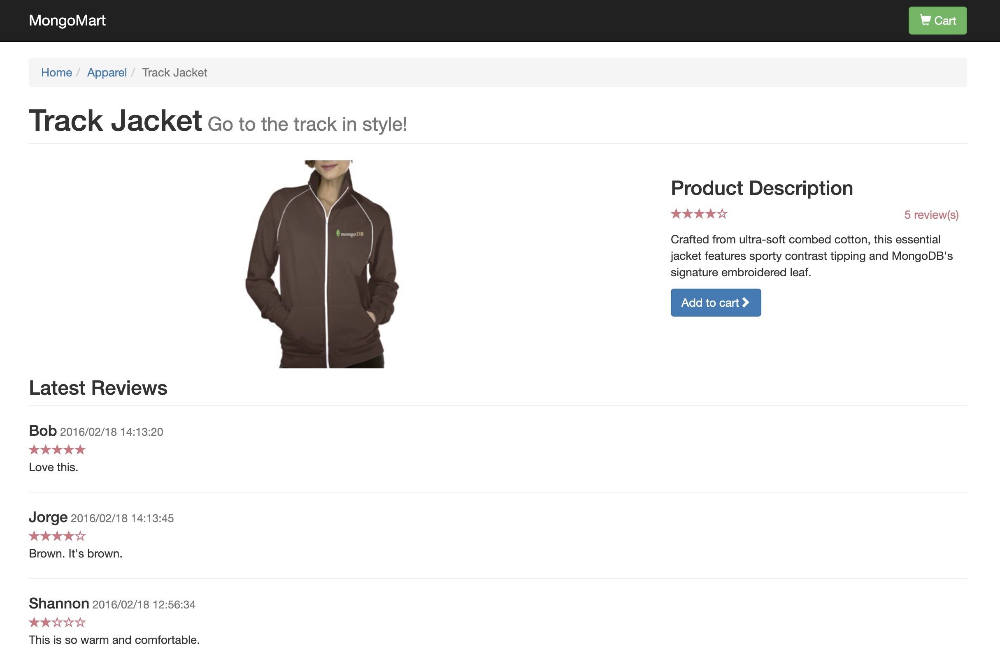
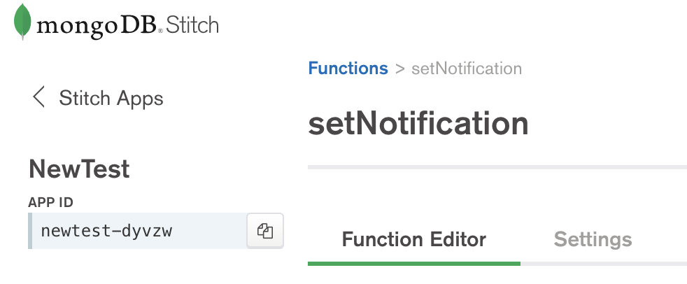

# Build Web Apps Faster Using Stitch Rules & React
*Author*: [Robbert Kauffman](mailto:robbert.kauffman@mongodb.com)

## Introduction

Modern web applications are often built using API-based front-ends such as React, Angular, 
VueJs. In this session, we will dive into how Stitch can be used to provide APIs for your 
front-end, removing the need for writing and maintaining boilerplate back-end services, and 
having to manage and scale back-end servers. All to make developer’s lives easier.

## Step 1 — Creating a Stitch App

In [Atlas](https://cloud.mongodb.com):
1. Navigate to *Stitch* using the left hand navigation
2. Click *Create New Application*

3. In the dialog window, name the app, select one of your Atlas clusters to link it, and hit 
*Create*.


## Step 2 — Setting up Stitch App

- Open your app by selecting it from the Stitch Applications list if it doesn’t automatically 
  open after a few minutes
- On the Getting Started screen: Turn on Anonymous Authentication 

- Click *Review & Deploy Changes* at the top and click *Deploy* in the dialog window
- Copy your Stitch App ID in top-left corner


## Step 3 — Setting up MongoMart front-end

- Go to https://stackblitz.com/edit/mongomart-world-session-1
  - StackBlitz is an online IDE and app server for easily editing code and running apps online

## StackBlitz


## Step 4 — Setting up MongoMart front-end

- Edit *config.js*: change value of Stitch App ID on line 2 to your Stitch App ID
- Reload Live App (on the right) if you get following error: default app can only be set once;  currently set to 'XXX’
- Your screen should look like this:


## Exercise 1.1 — Adding a read-rule

- Go to your Stitch app
- Go to *Rules*
- Create a new rule by clicking on the *Add Collection* button

  - Enter `mongomart` as database name, and press return or click *Create*
  - Enter `item` as collection name, and press return or click *Create*
  
  - Select *Users can only read all data* as template
  - Click the green *Add collection* button at the bottom
  - Click *Review & Deploy Changes* at the top and click *Deploy* in the dialog window
- Go back to the Live App and reload: do you see any products?


## Exercise 1.2 — Temporary permissions for Importing data

- Go back to the item-rule in *Rules* in your Stitch App
- Enable write-permissions by checking the *Write* checkboxes
- Edit the *default* (1) permissions and:

  - Enable *Insert Documents* and *Delete Documents*
  
  - Click *Done Editing*
- Don’t forget to click *Save* on the top right and *Review & Deploy Changes*
- Go back to the Live App and:
  - Click the *Import Items* link in the footer
  - Reload
  - Products should now be visible!
  

## (Optional) Exercise 1.3 — Fixing the rule

- Go back to the item-rule in *Rules* in your Stitch App
- Disable the write-permissions by unchecking the *Write* checkboxes

- Edit the default permissions and:
  - Uncheck Insert Documents and Delete Documents
  - Click Done Editing
- Don’t forget to click *Save* on the top right and *Review & Deploy Changes*
- All set now!

## Exercise 2 — Adding a write-rule

- Go back to *Rules* in your Stitch App
- Create a new rule by clicking on … and *Add Database/Collection*

  - Enter `mongomart` as database name
  - Enter `reviews` as collection name, and press return or click *Create*
  - Select *Users can read all data, but only write their own data* as template
  - Enter `userid` for field name for User ID
  - Click the green *Add collection* button at the bottom
  - *Review & Deploy Changes*
- Go back to Live App, reload, and:
  - Cart should now be visible and you should be able to add products to cart from product 
  detail pages!
  

## Exercise 3 - Displaying Reviews

We’re going to display recent reviews for the product detail page.
- Uncomment line 20 in *src/Reviews/Reviews.js*
- Edit in same file:
  - Add following code to fetchReviews() on line 25:
    - Get database handle:
      ```js
        const db = this.props.client
          .getServiceClient(
            RemoteMongoClient.factory,
            stitchClusterNames.reviews
          )
          .db(dbName);
      ```
    - Query database:
      ```js
      this.props.clientAuthenticated
        .then(() => db
          .collection(collNames.reviews)
          .find({productId: this.props.itemId})
          .asArray()
        )
      ```
    - Process response:
      ```js
      .then(response => {
        if (response) {
          this.setState({
            reviews: response,
            reviewsError: null
          });
        }
      })
      ```
    - Error handling:
      ```js
      .catch(err => {
        this.setState({
          reviewsError: err
        });
        console.error(err);
      });
      ```
- Test & Review: Go to Live App, reload, go to one of the product pages and try submitting a review.


## Exercise 4 — Adding a Stitch function

- Go to *Functions* in your Stitch App
- Click *Create New Function*
  - Use the name `setNotification` (case sensitive)
  - Check the *Run As System* toggle
  
  - Open the *Function Editor* tab
  - Select all sample code and replace with code from *stitch/setNotification.js* in 
    Stackblitz
  
  - Click *Save*
  - *Review & Deploy Changes*
- Go back to Live app, reload, and:
  - View the *Coffee Mug* detail page and click on *Notify me when in stock*
  

## Bonus Exercise - Enabling Cart

- Go back to *Rules* in your Stitch App
- Create a new rule by clicking on … and *Add Database/Collection*

  - Enter `mongomart` as database name
  - Enter `users` as collection name, and press return or click *Create*
  - Select *Users can only read and write their own data* as template
  - Enter `_id` for field name for User ID
  - Click the green *Add collection* button at the bottom
  - *Review & Deploy Changes*
- Go back to Live App, reload, and:
  - Cart should now be visible and you should be able to add products to cart from product 
  detail pages!
  
